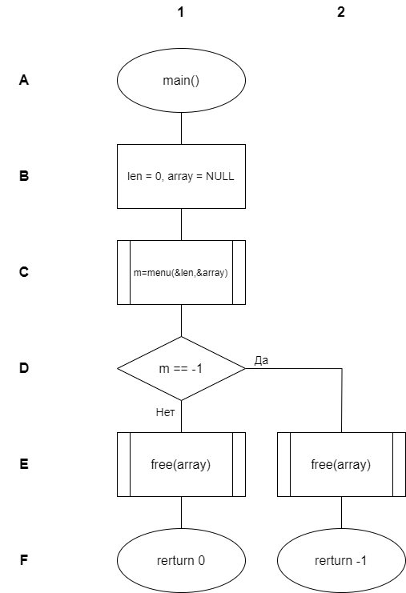
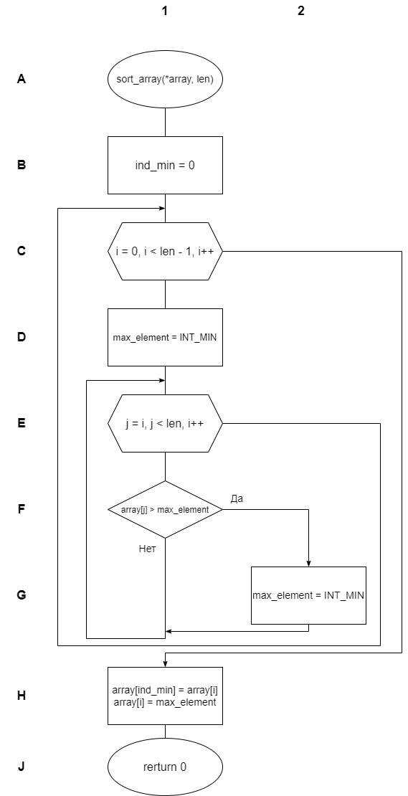
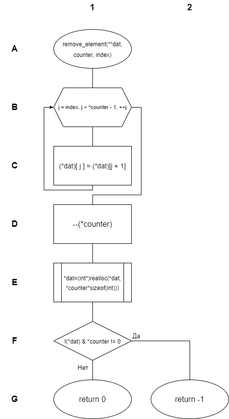
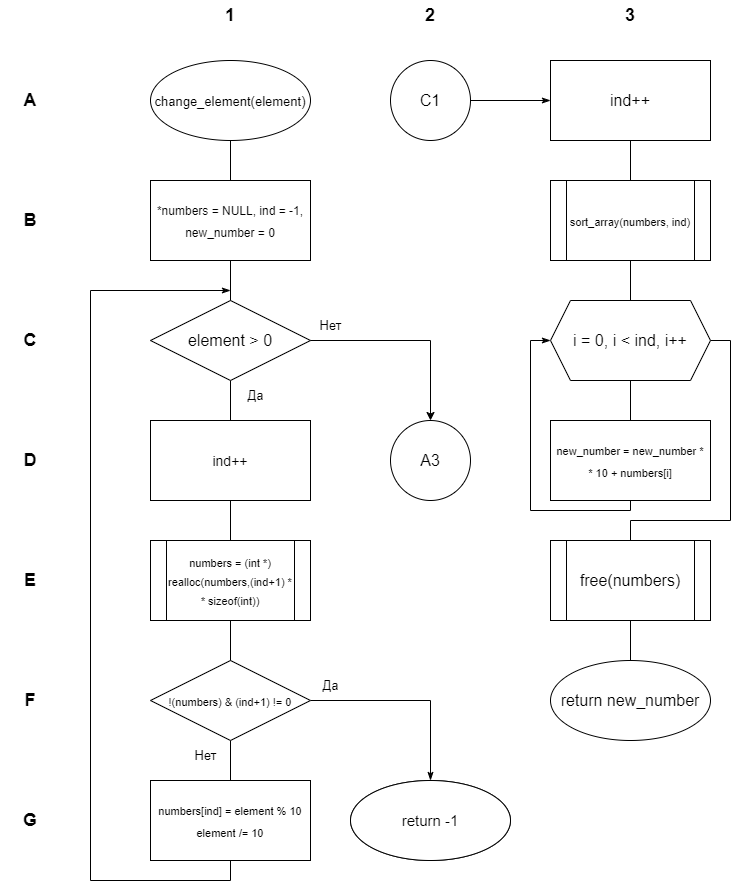
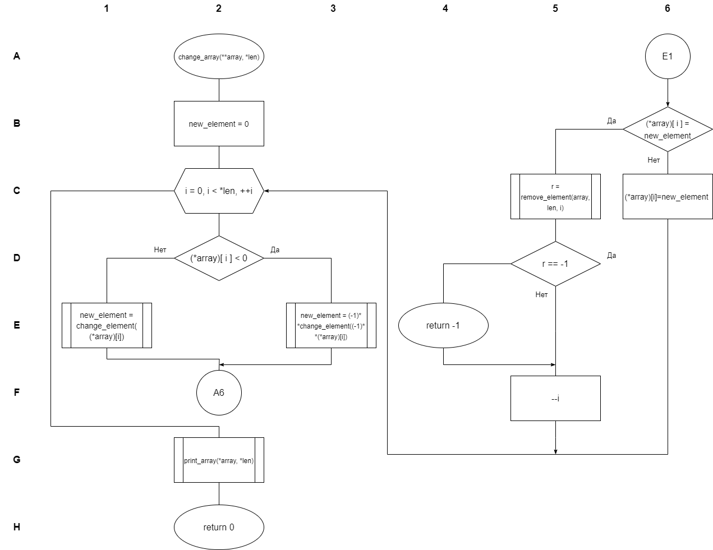
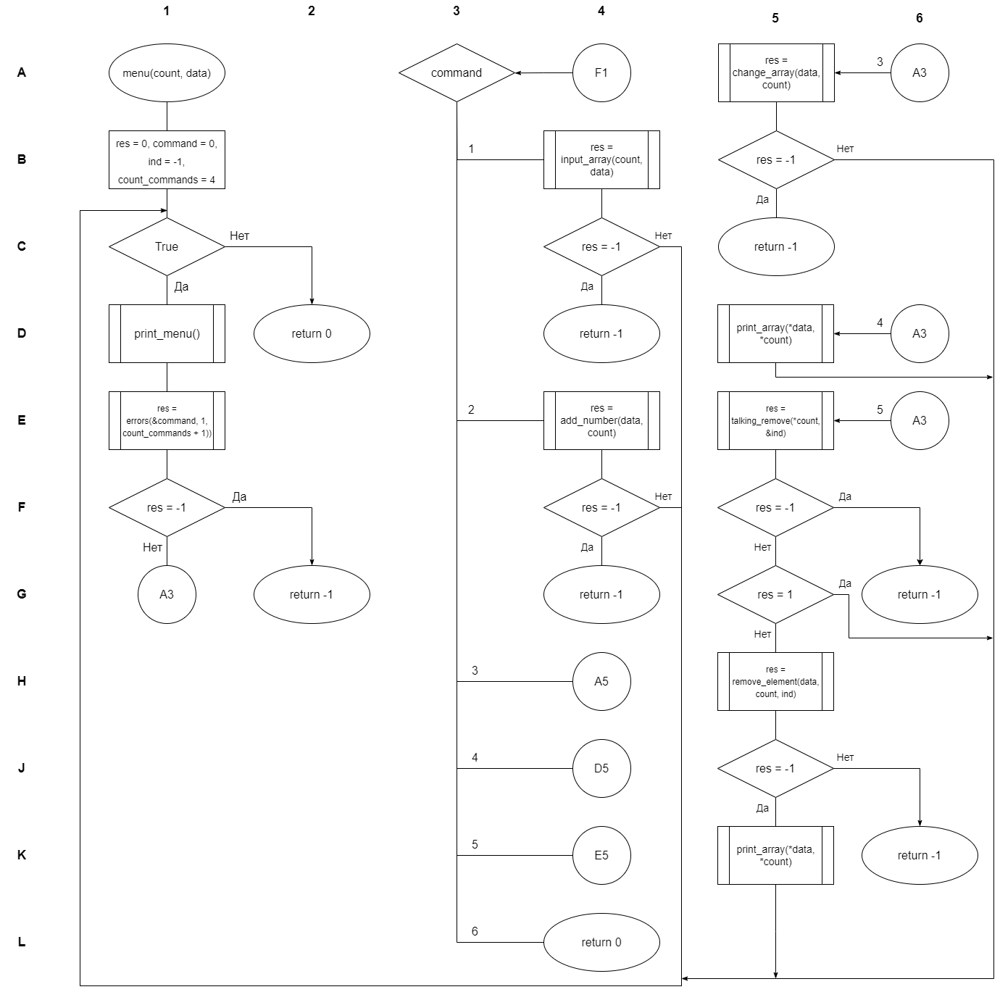

# Лабораторная работа №3  
_Работа с массивами данных_

---

## Постановка задачи  
**Вариант №51**

Из элементов исходной последовательности целых чисел сформировать новую последовательность, в которой цифры каждого числа переставлены так, чтобы его модуль был максимальным. Удалить из исходной последовательности элементы, значения которых не изменились.

---

## Описание решения  
### Используемые типы данных  
- `int` - для хранения чисел и индексов
- `int*` - для работы с массивами
- `int**` - для динамического изменения массивов

### Блок-схемы алгоритмов

<table>
  <tr>
    <td>
      <figure>
        
        <figcaption>Блок-схема main</figcaption>
      </figure>
    </td>
    <td>
      <figure>
        
        <figcaption>Блок-схема sort_array</figcaption>
      </figure>
    </td>
  </tr>
  <tr>
    <td>
      <figure>
        
        <figcaption>Блок-схема remove_element</figcaption>
      </figure>
    </td>
    <td>
      <figure>
        
        <figcaption>Блок-схема change_element</figcaption>
      </figure>
    </td>
  </tr>
  <tr>
    <td colspan="2">
      <figure>
        
        <figcaption>Блок-схема add_number</figcaption>
      </figure>
  </tr>
  <tr>
    <td colspan="2">
      <figure>
        
        <figcaption>Блок-схема change_array</figcaption>
      </figure>
  </tr>
  <tr>
    <td colspan="2">
      <figure>
        
        <figcaption>Блок-схема menu</figcaption>
      </figure>
  </tr>
</table>

---

## Описание функций

### Файл menu.h
- `printMenu()`
    > Выводит меню пользовательского интерфейса

- `menu(count: int*, data: int**) -> int`
    > Управляет основным потоком выполнения программы
    >
    > _ПАРАМЕТРЫ:_  
    >    * **count** - Указатель на размер массива  
    >    * **data** - Двойной указатель на массив данных  
    >
    > _ВОЗВРАЩАЕТ:_  
    >    * 0 при успешном завершении, -1 при ошибке

### Файл array.h
- `printArray(array: int*, len: int)`
    > Выводит массив на экран
    >
    > _ПАРАМЕТРЫ:_  
    >    * **array** - Указатель на массив  
    >    * **len** - Длина массива

- `inputArray(len: int*, array: int**) -> int`
    > Запрашивает и инициализирует новый массив
    >
    > _ПАРАМЕТРЫ:_  
    >    * **len** - Указатель на размер массива  
    >    * **array** - Двойной указатель на массив  
    >
    > _ВОЗВРАЩАЕТ:_  
    >    * 0 при успехе, -1 при ошибке

- `addNumber(array: int**, len: int*) -> int`
    > Добавляет элементы в массив
    >
    > _ПАРАМЕТРЫ:_  
    >    * **array** - Двойной указатель на массив  
    >    * **len** - Указатель на размер массива  
    >
    > _ВОЗВРАЩАЕТ:_  
    >    * 0 при успехе, -1 при ошибке

- `talkingRemove(len: int, index: int*) -> int`
    > Обрабатывает ввод индекса для удаления
    >
    > _ПАРАМЕТРЫ:_  
    >    * **len** - Текущий размер массива  
    >    * **index** - Указатель на индекс для удаления  
    >
    > _ВОЗВРАЩАЕТ:_  
    >    * 0 при успехе, 1 если массив пуст, -1 при ошибке

### Файл changing.h
- `sortArray(array: int*, len: int) -> int`
    > Сортирует массив по убыванию
    >
    > _ПАРАМЕТРЫ:_  
    >    * **array** - Указатель на массив  
    >    * **len** - Длина массива  
    >
    > _ВОЗВРАЩАЕТ:_  
    >    * 0 при успешном выполнении

- `changeElement(element: int) -> int`
    > Преобразует число для максимального модуля
    >
    > _ПАРАМЕТРЫ:_  
    >    * **element** - Исходное число  
    >
    > _ВОЗВРАЩАЕТ:_  
    >    * Преобразованное число или -1 при ошибке

- `removeElement(dat: int**, counter: int*, index: int) -> int`
    > Удаляет элемент по указанному индексу
    >
    > _ПАРАМЕТРЫ:_  
    >    * **dat** - Двойной указатель на массив  
    >    * **counter** - Указатель на размер массива  
    >    * **index** - Индекс удаляемого элемента  
    >
    > _ВОЗВРАЩАЕТ:_  
    >    * 0 при успехе, -1 при ошибке

- `changeArray(array: int**, len: int*) -> int`
    > Основная функция преобразования массива
    >
    > _ПАРАМЕТРЫ:_  
    >    * **array** - Двойной указатель на массив  
    >    * **len** - Указатель на размер массива  
    >
    > _ВОЗВРАЩАЕТ:_  
    >    * 0 при успехе, -1 при ошибке

### Файл checker.h
- `errors(number: int*, start: int, finish: int) -> int`
    > Проверяет корректность ввода числа
    >
    > _ПАРАМЕТРЫ:_  
    >    * **number** - Указатель на проверяемое число  
    >    * **start** - Нижняя граница диапазона  
    >    * **finish** - Верхняя граница диапазона  
    >
    > _ВОЗВРАЩАЕТ:_  
    >    * 0 при корректном вводе, -1 при ошибке

---

## Тестирование  
### Тестовые примеры
| Действие               | Ввод                        | Результат                        |
|------------------------|-----------------------------|----------------------------------|
| Создание массива       | [1, 345667, -9898, 0, 8642] | [1, 345667, -9898, 0, 8642]      |
| Добавление элемента    | 444 (на позицию 0)          | [444, 1, 345667, -9898, 0, 8642] |
| Преобразование массива | -                           | [766543, -9988, -2211]           |
| Удаление элемента      | индекс 3                    | [766543, -9988, -2211]           |